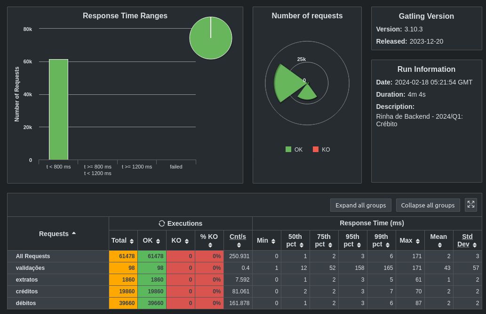

<h1 align="center">
   Rinha back-end 2024 Q1
</h1>

## 💻 Tecnologias:
- `nodejs` 
- `postgreSQL`
- `nginx`

## ⚙️ NodeJS:
- `express`
- `pg`
- `dotenv`

## Executar projeto:
```
make
```

## Executar teste:
```
make test
```

## Gatling


<div  align="center">

[](https://www.linkedin.com/in/luisescosta)
[](https://github.com/luisescosta)
<br>
    @luisescosta
<div>